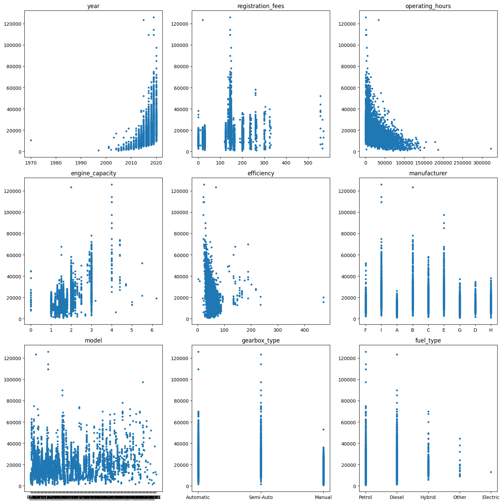
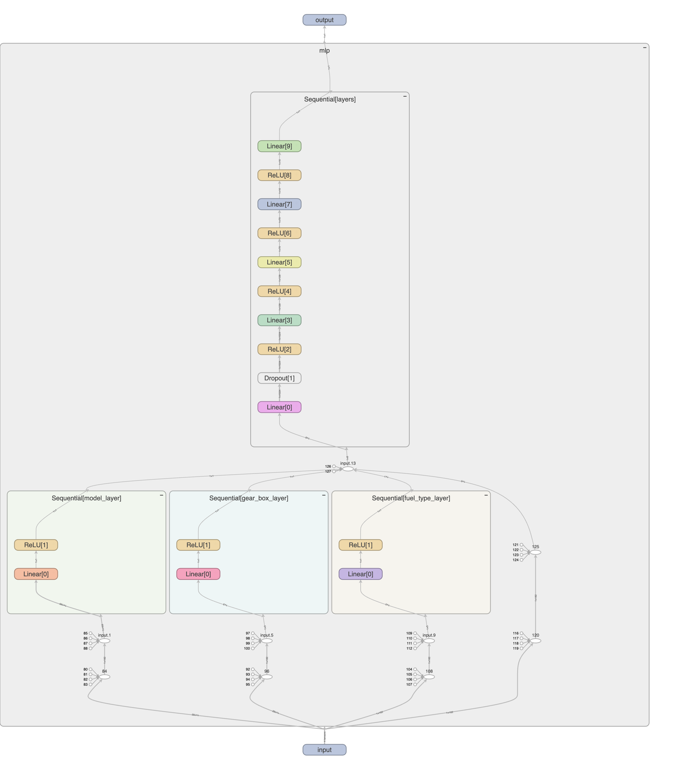
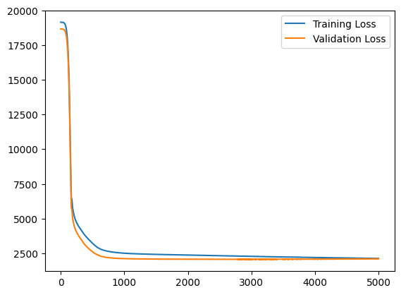
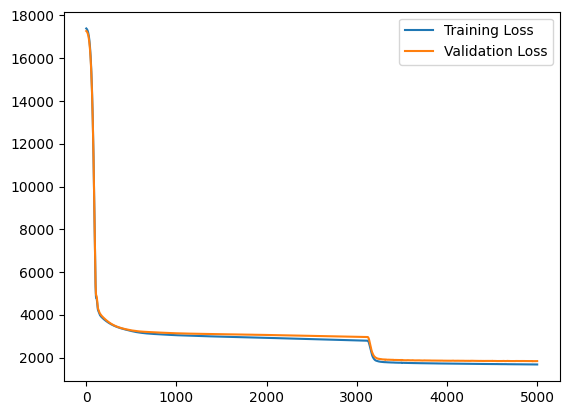

# Project Report: Car Price Prediction

## Introduction

This is the final project of COMP 5212 Machine Learning, focusing on predicting car prices using machine learning algorithms.

## Project Structure

The workspace is organized as follows:

```
data/
    test.csv
    train.csv
data_analy.ipynb
encoder.pkl
inference.py
isoforest_model.pkl
mlp_model.pth
mlp.ipynb
model.pkl
output.csv
preprocessing.py
run.sh
scaler.pkl
```

## Data analysis

Data analysis is performed in [data_analy.ipynb](data_analy.ipynb), our outcome is the scatter graph of the price of the car and the various attributes of the car.



We can see tha the price of the car is correlated to the attributes, but it is more complicated than a linear relationship.

Also, the manufacturer of the car is a redundant attribute, as it is included in the model of the car.(e.g. model A_1 is from brand A)

Moreover, we can classify the attributes into two categories, discrete and continuous attributes. Labeled data fuel_type, gearbox_type, model, and manufacturer are discrete attributes, others like engine_capacity, registration_fees, years seems also discrete. While the operating_hours and efficiency are continuous attributes. More information will be revealed in the data preprocessing part.

## Data Preprocessing

Data preprocessing is handled in [preprocessing.py](preprocessing.py).

There are three functions for preprocessing:

- 'encode_data': This function is used to encode the label data into numerical data. The data is encoded using 'OneHotEncoder' from 'sklearn'. It will encode 'fuel_type', 'gearbox_type', 'model', and 'manufacturer' into numerical data. The encoder is saved to 'encoder.pkl' for inference.

- 'standardize_data': This function is used to standardize the continuous data. The data is standardized using 'StandardScaler' from 'sklearn'. The scaler is saved to 'scaler.pkl' for inference.

- 'outlier_remoal': This function is used to remove outliers from the data. The outliers are detected using 'IsolationForest' from 'sklearn'. The model is saved to 'isoforest_model.pkl' for inference. 1% of the data is removed as outliers, this will prevent the model from overfitting from the outliers.

Other approaches are also tried, be discussed in the Attempts to Improve the Model part.

## Model Training

The MLP model is implemented in [mlp.ipynb](mlp.ipynb).

### Model Architecture



Preventing the label data overfitting, three extra layers is added for those data. Joined the rest of the data in the sequential model.

### Loss Function

The validation loss is constructed by holding out 20% of the training data for validation.

Loss function is using RMSELoss. Using an Adam optimizer with a learning rate of 0.001, and weight decay of 0.001 to prevent overfitting.

### Training

The model is trained for 5000 epochs, and an early stopping mechanism is used to prevent overfitting. The model is saved to 'mlp_model.pth' for inference.

### Evaluation

The model converges with a validation loss of 2120. The model is evaluated using the public test data, and the RMSE is calculated to be 2507.

For testing with the outliers, the model is evaluated using the training data with outliers, and the RMSE is calculated to be 2274.



The model also encountered some weird behavior, welcome to discuss.



## Failed attempts to Improve the Model(More details in the legacy folder)

### Label Encoding
[legacy/preprocessing](legacy/preprossesing.py)
Label encoding is used to encode the label data into numerical data. But since the label is not correlated as a linear relationship(such as low, medium, high), the model will be confused by the label data. So one-hot encoding is used instead.

### Discrete Attributes
[legacy/preprocessing](legacy/preprossesing.py)
Engine_capacity, registration_fees, years was considered as discrete attributes. KBinsDiscretizer was used to discretize the data, and one-hot encoding was also used to encode the data. But the model is not improved.

### Linear Regression
[legacy/linear_regression](legacy/linear_regression.ipynb)
Kernel Ridge Regression is used to predict the price of the car. But it suffers from underfitting, thus removed.

### Random Forest Regression
[legacy/random_forest_regression](legacy/random_forest_regression.ipynb)
Random Forest Regression is used to predict the price of the car. But it suffers from overfitting, thus removed.

## Inference

The inference can run with the following command:

```bash
./run.sh
```

The output will be saved to 'output.csv'.

## Credits

This project is done by [boring180](https://boring180.github.io/)
bxuar@connect.ust.hk
Course project of COMP 5212 Machine Learning, The Hong Kong University of Science and Technology. Fall 2024.